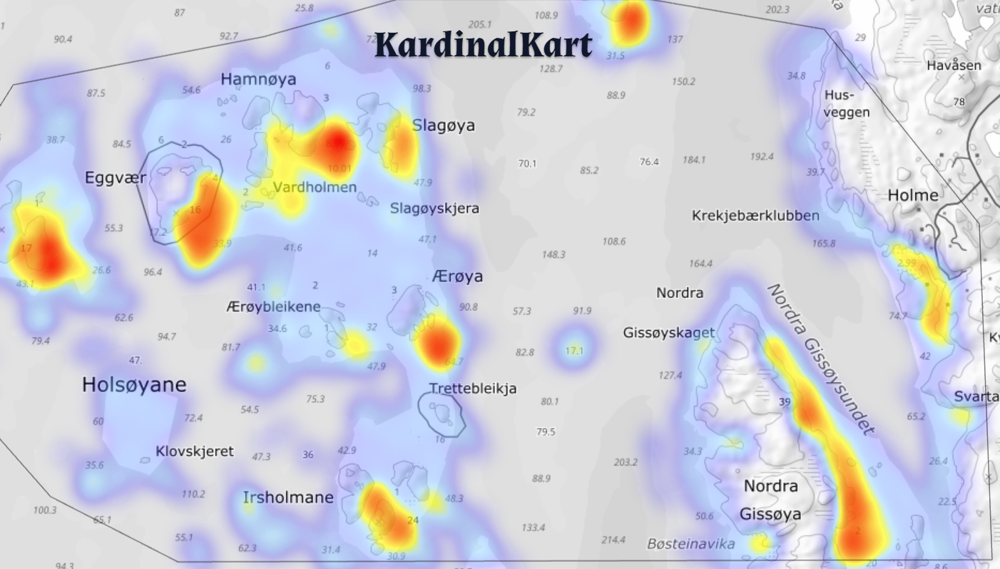
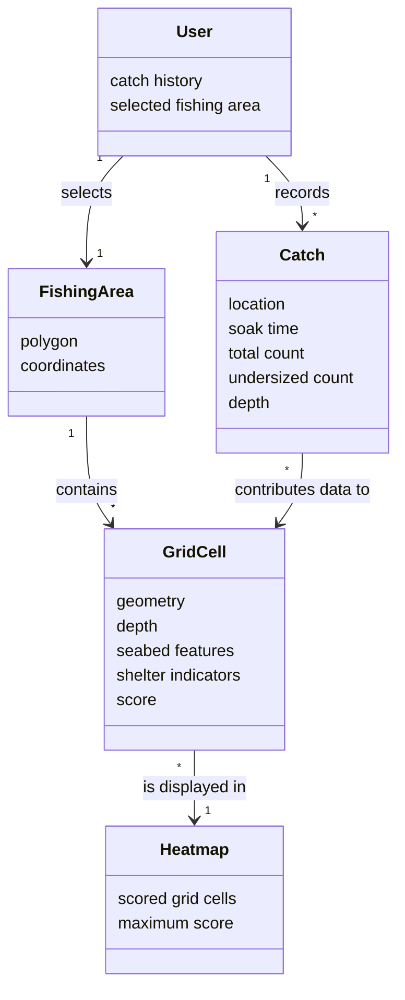

# KardinalKart

KardinalKart is an application designed to help recreational fishermen decide where to set their lobster traps. Check it out on kardinalkart.no

The recommendations are based on a combination of the user's previously registered catches and calculations inspired by local fishing knowledge. The results are visualized as a heatmap layered over a map of the fishing area selected by the user.

## How to use

1. Open KardinalKart in your browser.
2. Draw the local fishing area you want to investigate.
3. Generate a grid for the selected area.
4. View the resulting heatmap.
5. Use the heatmap as guidance when deciding where to place your traps.
6. Register your catches, including:
    - Location
    - Soak time
    - Total number of lobsters caught
    - Number of undersized lobsters
    - Optional depth

The heatmap is intended as decision support, not as a guarantee of a catch. Conditions at sea, weather, bait, timing, equipment, and local knowledge will always influence the result.

## Stack

- **Languages:** Python (backend), JavaScript (frontend)
- **Framework / runtime:** FastAPI and React with Vite
- **Database:** PostgreSQL with the PostGIS extension
- **UI:** React 19, Tailwind CSS, shadcn components, and Lucide icons
- **Notable libraries:** SQLAlchemy, Pydantic, Base UI, and PostGIS spatial functions

## Responsible fishing and cultural heritage

Lobster fishing is more than a recreational activity. Along the coast, it is part of a living cultural heritage passed down through generations. KardinalKart is intended to support this tradition by making local knowledge and personal catch history easier to record, understand, and share with younger and less experienced fishermen.

At the same time, lobster populations are vulnerable to overfishing and environmental changes. A tool that makes it easier to find promising locations could potentially increase fishing pressure if it is used without care. For that reason, KardinalKart should be understood as a tool for better decisions—not as a tool for catching as many lobsters as possible.

One possible benefit is that the application may help distribute fishing opportunities more evenly. Beginners often have little knowledge about where traps should be placed, while experienced fishermen may have spent many years learning the same waters. If KardinalKart does not increase the total number of lobsters caught, but instead helps newcomers make more informed choices, it may distribute the lobsters more evenly between the fishermen.

The application should always be used together with:

- Local fishing regulations
- Catch limits and minimum/maximum size requirements
- Restrictions on fishing seasons and equipment
- Responsible handling and release of undersized/oversized lobsters
- Respect for local knowledge and the marine environment

The goal is not to remove the human element from lobster fishing. It is to combine personal experience, geographic data, traditional knowledge, and responsible decision-making in a way that helps preserve the activity for future generations.

## Class diagram



## Data sources and calculations

KardinalKart combines user-generated catch data with geographic and bathymetric data.

### User-generated data

Users can register individual catches. Each catch may include:

- Geographic position
- Soak time
- Total catch
- Number of undersized lobsters
- Water depth

Catch records are stored in PostgreSQL with geographic coordinates using PostGIS.

The selected fishing area is also stored as a geographic polygon. This makes it possible to save and reuse the user's local fishing area.

### Geographic data

The application uses geographic data from Kartverket and bathymetric data stored in PostGIS. The database contains information such as:

- Depth areas
- Depth points
- Shoals
- Rocks and underwater obstacles
- Depth contours
- Other seabed features

The selected fishing area is divided into hexagonal grid cells. Each cell is then analysed using spatial queries in PostGIS.

### Cell scoring

Each grid cell receives a score based on several factors:

- **Depth:** Water depths between approximately 5 and 20 metres receive the highest depth score.
- **Shoals:** Shallow areas may provide suitable lobster habitat.
- **Depth points:** Different types of seabed and depth points contribute different amounts to the score.
- **Rocks:** The presence of rocks may indicate suitable habitat.
- **Depth contours:** A steep change in depth can increase the score.
- **Shelter:** Land or islands to the north-west of a cell contribute to its shelter score.

The factors are weighted independently before being combined into a total score. Cells that are too shallow, land-based, or located in the intertidal zone receive no score.

The resulting scores are returned to the frontend and displayed as a heatmap. Areas with higher scores are shown as more promising locations, but the score should not be interpreted as a guaranteed probability of catching lobster.

## Project structure

```text
app/
  main.py           FastAPI application and API endpoints
  db.py             Database connection
  grid.py           Grid generation and PostGIS queries
  kalkulering.py    Grid-cell scoring calculations
  omraade.py        Fishing-area storage and retrieval
  trekk.py          Catch registration and storage

frontend/
  src/              React frontend source code
  package.json      Frontend dependencies and scripts

static/              Static application files
docker-compose.yml   Local PostGIS database configuration
.env.example         Example environment configuration
```

## Project status

KardinalKart is under active development. Some functionality, including catch retrieval and parts of the frontend workflow, may still be incomplete or subject to change.
